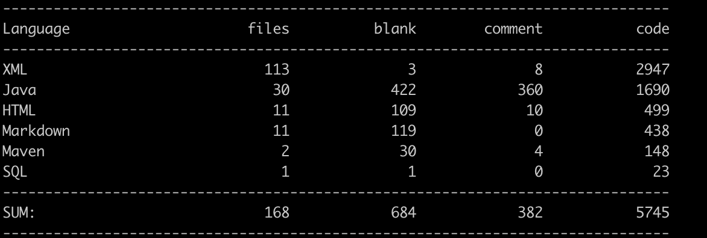

# 分布式Web网站

本项目是使用Java语言开发的一个分布式Web应用网站，项目的起源是笔者在[牛客网](https://www.nowcoder.com/)学习的一个中级项目。主要内容有：

- Web框架使用了Spring Boot、Spring MVC和MyBatis搭建
- 数据库使用了MySQL和Redis
- 使用异步设计和多线程提高系统性能

对于没有实践过的小白来说，该Web网站可以一个很好的练手项目。笔者作为一个傲娇的转行程序员小白，不愿意就这样被人投食，为了提高笔者的学习能力，笔者对于牛客网的项目做了修改和增加，目前网站可以分为4个模块：

**前端模块：** 为了弄清前后端的交互逻辑，前端代码利用Boostrap重新新写过

**博客模块：** 在完成原项目的注册、登录、留言、评论、点赞和发布博客的基础功能之上，添加了如下的功能，从而提高服务器的性能：

- 使用基于内存的Redis的缓存可以提高频繁点赞点踩的功能，而集群的Redis可以缓解单机Redis数据库的压力
- 使用Zookeeper的Master选举机制，实现热门博客的排序更新，避免了多机的重复计算以及单点故障的问题
- 使用Kafka作为消息队列，异步处理。比如在用户注册完成之后，发送邮件信息提醒完善用户信息

**用户认证中心模块：** 使用RPC远程过程调用，实现用户注册登录的数据统一管理，并且利用Cookie和Session实现了免登陆和单点登录，提升用户体验

**秒杀系统模块：** 使用Zookeeper实现分布式锁，完成秒杀系统的基础功能，保证数据的安全
	
该项目只是供笔者对一些开源框架和基础工具的学习Demo，由于笔者脑容量实在有限，不得不在此记录下学习的过程，也提供给广大的初学者作为Demo参考。

目前该网站的代码也不多，详细代码量如下，之后如果有合适加入的功能，笔者会塞进去的。

## 功能拆解

|[热点数据更新](./readme/热点数据更新.md)|[异步设计](./readme/异步设计.md)|[登录系统](./readme/登录系统.md)|[秒杀系统](./readme/秒杀系统.md)|
|:---:|:---:|:---:|:---:|
|Redis实现点赞/点踩的缓存 ZooKeeper选举实现热门博客的更新|在分布式系统中使用Kafka作为消息队列完成邮件发送的异步操作|Cookie、Session和RPC实现的免登陆和单点登录|Redis和Zookeeper实现分布式锁的分析与实现|

**再次感谢牛客网的CEO叶向宇提供的高质量课程。**